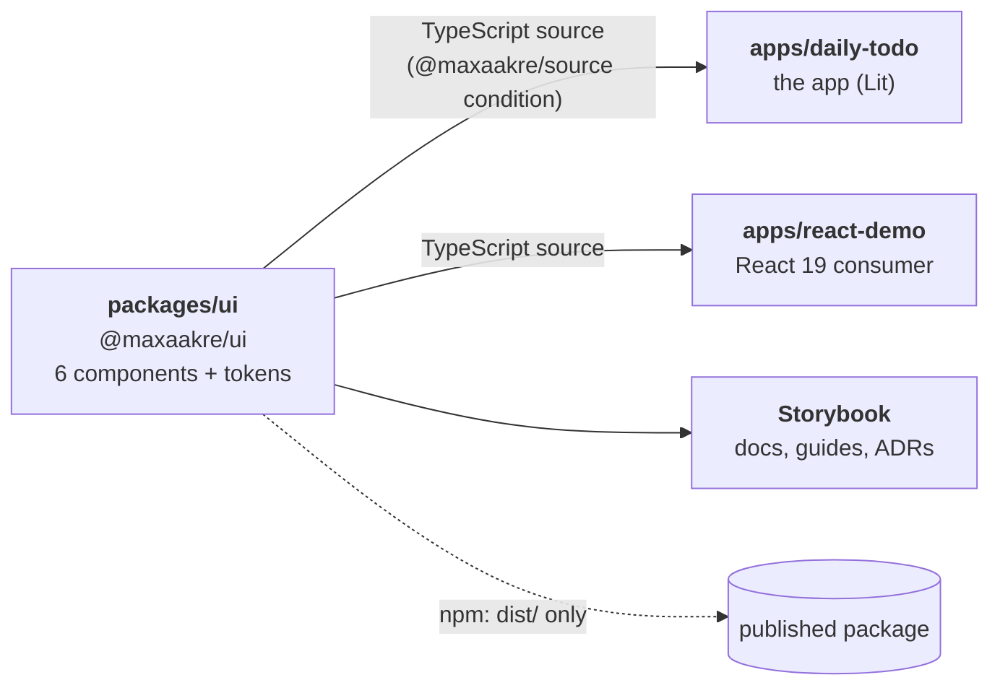
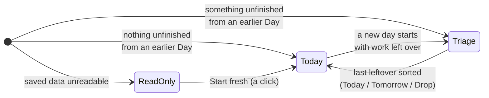
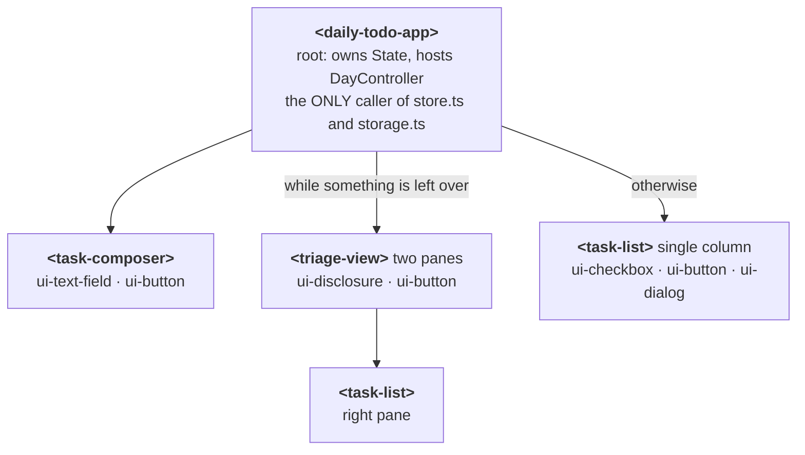
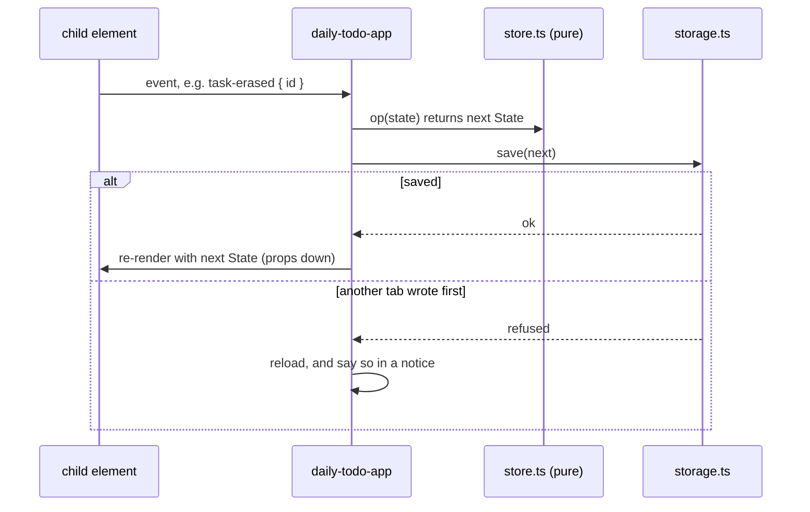

# Daily Todo

A local-first daily planner built with **Lit** and **TypeScript**.

Not a bucket that grows forever. Every Task belongs to a **Day**, and anything you did not finish has to be dealt with deliberately the next morning — moved, dropped, or pushed to tomorrow.

The app is also a **learning vehicle for Lit and web components**, so idiomatic Lit is valued over feature count.

---

## Status

**Built and working.**

| | |
|---|---|
| The app | ✅ built, matches the design ([9 of 9 decisions](.scratch/daily-todo/map.md)) |
| Component library | ✅ `@maxaakre/ui`: 6 components, Storybook, tokens ([spec](./docs/superpowers/specs/2026-09-25-ui-library-design.md)) |
| Tests | ✅ **227 passing**: 68 app, 149 library, 10 React demo. CI runs them on every push |
| Multi-device sync | 🧭 planning: [5 of 13 tickets resolved](.scratch/multi-device-sync/map.md) |
| Deployment | ⏳ ready (`vercel.json`); waits on connecting a Vercel account |

Also verified by hand in a browser: dark mode, and the full triage flow end to end.

---

## Getting started

**Requirements:** Node 24+, pnpm 10+.

```bash
pnpm install
pnpm dev
```

Then open **http://localhost:5173/**.

### Commands

| Command | Does |
|---|---|
| `pnpm dev` | The app, with hot reload |
| `pnpm storybook` | The component library's Storybook, on http://localhost:6006 |
| `pnpm --filter react-demo dev` | The React 19 demo |
| `pnpm build` | Typecheck and build every package |
| `pnpm preview` | Serve the app's production build locally |
| `pnpm test` | Every package's tests, once |
| `pnpm test:watch` | The app's tests, in watch mode |
| `pnpm typecheck` · `pnpm lint` | What CI runs before the tests |
| `pnpm changeset` | Record a change to `@maxaakre/ui` for the next release |

### Layout

A pnpm workspace. Run every command from the repo root.



- **`apps/daily-todo/`** — the app
- **`packages/ui/`** — `@maxaakre/ui`, the component library pulled out of this app. See [its README](./packages/ui/README.md) and [the spec](./docs/superpowers/specs/2026-09-25-ui-library-design.md)
- **`apps/react-demo/`** — every component used from React 19, with tests

Inside the workspace, both apps read the library's **TypeScript source**, so there is no library build step and edits hot-reload. Published consumers get `dist/`. (Why: [ADR 0005](./packages/ui/src/docs/decisions/0005-source-condition.mdx).)

### Versions

`lit` 3.3.3 · `typescript` 6.0.3 · `vite` 8.3.0

---

## How it works

### The vocabulary

Defined properly in [`CONTEXT.md`](./CONTEXT.md). In short:

- **Task** — one thing to do. A title, a status, a Day, a position.
- **Day** — a dated bucket of Tasks. The unit you plan in.
- **Today** — whatever `currentDay()` resolves to. Not simply the calendar date.
- **Triage** — deciding the fate of Tasks left unfinished on an earlier Day.

### The daily flow

1. You open the app. Anything **unfinished from any earlier Day** is pulled in front of you — not just yesterday, so a skipped weekend cannot orphan Friday's work.
2. **Triage** shows two panes: unfinished work on the left, today's plan filling up on the right. Each leftover gets one of three verdicts — **Today**, **Tomorrow**, or **Drop**.
3. Once nothing is older than today, the view **collapses to a single-column Today** list. Triage is the transient state, not the resting one.
4. Triage never blocks you. Today stays visible and usable throughout. The leftovers pane can be collapsed, which helps on a phone, where the two panes stack.



Tasks moved into today land at the **bottom** of the plan — what you chose deliberately keeps its place.

A Task can also be **erased** from the list with the ✕ button. It **asks first**, in a dialog, because there is **no undo**: the Task never shows again. (Since ticket 13 of the sync map, the row stays in storage with `status: 'erased'`, but nothing in the UI brings it back.) After an erase, focus moves to the next Task.

### Storage

Everything lives in `localStorage` under **one key**:

```ts
"daily-todo/v1" → { version: 2, tasks: Task[] }

type Task = {
  id: string;        // crypto.randomUUID()
  title: string;
  status: 'open' | 'done' | 'abandoned' | 'erased';
  day: string;       // "YYYY-MM-DD" — a LABEL
  order: number;     // integer, renumbered within a Day
  updatedAt: string; // ISO 8601 — an absolute INSTANT
}
```

**Nothing is ever removed from the array.** Drop sets `abandoned`, ✕ sets `erased`; both stay as tombstones so a future sync cannot resurrect them. A v1 document (with `done: boolean`) is migrated on read and left untouched on disk until the next save. The storage key keeps its `v1` name; the version lives inside.

A **Day is derived, not stored** — it is just a filter on `day`, so the two can never disagree.

`day` and `updatedAt` are deliberately different kinds of time. `day` is a label a future day-start setting could shift. `updatedAt` is an absolute instant and nothing about day handling may touch it.

**Single user, single device, for now.** Multi-device sync is being planned in [its own map](.scratch/multi-device-sync/map.md). `id`, `updatedAt` and the tombstones exist so it needs no rewrite.

### Safety rules

- **Nothing is ever wiped automatically.** An unrecognised `version` or an unparseable payload puts the app into a **read-only state with saving disabled**. Starting fresh is a button you press. There is one copy of this data and no undo.
- **Two tabs cannot clobber each other.** A tab re-reads on focus, and a save refuses to write if the stored document changed underneath it. A reload is silent; a discarded write tells you.

---

## Architecture

### Elements

The app's own elements, and the `@maxaakre/ui` components (`ui-*`) each one uses:



Each child sends one kind of event up to the root:

| Element | Event | When |
|---|---|---|
| `<task-composer>` | `task-added { title }` | Add, or Enter in the field |
| `<triage-view>` | `task-triaged { id, verdict }` | → Today, Tomorrow or Drop |
| `<task-list>` | `task-toggled { id }` | The checkbox |
| `<task-list>` | `task-erased { id }` | ✕, then **Erase** in the confirm dialog |

**Props down, events up.** No `@lit/context`, no signals. Child elements never mutate state — they dispatch a verdict and the root applies it:



### Plain TypeScript modules (no Lit imports)

| Module | Job |
|---|---|
| `store.ts` | Pure operations. `(state, …) => State`. No I/O. |
| `storage.ts` | The **only** module that touches `localStorage`. |
| `day.ts` | `currentDay()` — the single source of "today". |

`DayController` is a **Lit reactive controller**. It owns the `focus`/`visibilitychange` listeners, so the current Day re-resolves when you come back to the tab, and listener teardown is automatic.

### Styling

Design tokens come from **`@maxaakre/ui/tokens.css`**; the app's own `styles.css` holds only the page reset. Elements keep their own `static styles` and read the `--ui-*` tokens: **CSS custom properties are the one thing that crosses the shadow boundary**.

Each colour is written once as `light-dark(light, dark)`, so dark mode follows the OS through `color-scheme`. No in-app toggle.

---

## Three ways this breaks silently

Each one fails with **no error**. Worth knowing before you write a line.

**1. Mutating state does not re-render.** Lit's change detection is strict `!==`.

```ts
this.tasks = [...this.tasks, task];  // re-renders
this.tasks.push(task);               // silently does nothing
```

**2. `useDefineForClassFields: false` is load-bearing.** In `tsconfig.base.json` it looks like cruft. Flip it to `true` and standard class-field semantics overwrite the accessors `@property` and `@state` install. Reactivity dies quietly. Do not "clean this up".

**3. Forgetting to save loses data.** Only the root's single apply-and-save funnel may call `store.ts` and `storage.ts`. Skip the save, or ignore the fact that `save()` can fail, and changes vanish with no warning.

---

## Where the decisions live

Three places, one per kind of decision:

- **The app:** a **wayfinder map** in [`.scratch/daily-todo/`](.scratch/daily-todo/map.md). One decision per ticket (`issues/01`–`09`), each with its reasoning and the rejected alternatives.
- **Multi-device sync:** a second map, [`.scratch/multi-device-sync/`](.scratch/multi-device-sync/map.md), still in progress.
- **The component library:** [the spec](./docs/superpowers/specs/2026-09-25-ui-library-design.md), each component's README, and five ADRs in Storybook (**Decisions**).

If you want to know *why* something is the way it is, the ticket, README or ADR says so.

### Branches

Throwaway branches hold primary sources. None is merged, by design: `main` keeps only the decisions.

- **`prototype/triage-flow`** — the three Triage designs that were compared before picking the two-pane sorter. Check it out and run `pnpm prototype`.
- **`research/lit-state-architecture`** — the cited report behind the props-down/events-up choice.
- **`research/sync-engines`** — the cited report behind sync ticket 03 (roll our own sync).

## Tests

`pnpm test` runs every package. The app has **68 tests**, in two Vitest projects: pure logic on happy-dom, and `elements.test.ts` in real Chromium. The split exists because happy-dom has no `ElementInternals`, and the app's form controls come from `@maxaakre/ui`, which is form-associated. The library has its own suite (`packages/ui`).

They concentrate on the places that fail **silently**:

- `day.test.ts` — that `currentDay()` is **local time, not UTC**, plus month, year and leap-day boundaries
- `store.test.ts` — the leftovers filter across multiple earlier Days, bottom-ordering on a move, Drop and Erase keeping the row as a tombstone, immutability
- `storage.test.ts` — the version and corrupt refusals leaving data **byte-identical**, and the cross-tab write guard
- `elements.test.ts` — the two-pane/single-column switch, the composer, the Erase confirmation and where focus lands after it, and the error screen, driven through the real elements in Chromium

The suite was **mutation-checked**: making a moved Task land at the top, switching `currentDay()` to UTC, wiping on a version mismatch, and removing the write guard each produced failures. It is not a suite that passes regardless.

### Deliberately out of scope

**Multi-user and accounts.**

Parked for later: History, Backlog and Upcoming views, and the routing they would need.

No longer parked: **keyboard and accessibility** (every control now comes from `@maxaakre/ui`, tested with keyboard and axe in a real browser), **deployment** (ready, see Status), and **multi-device sync** (being planned).
